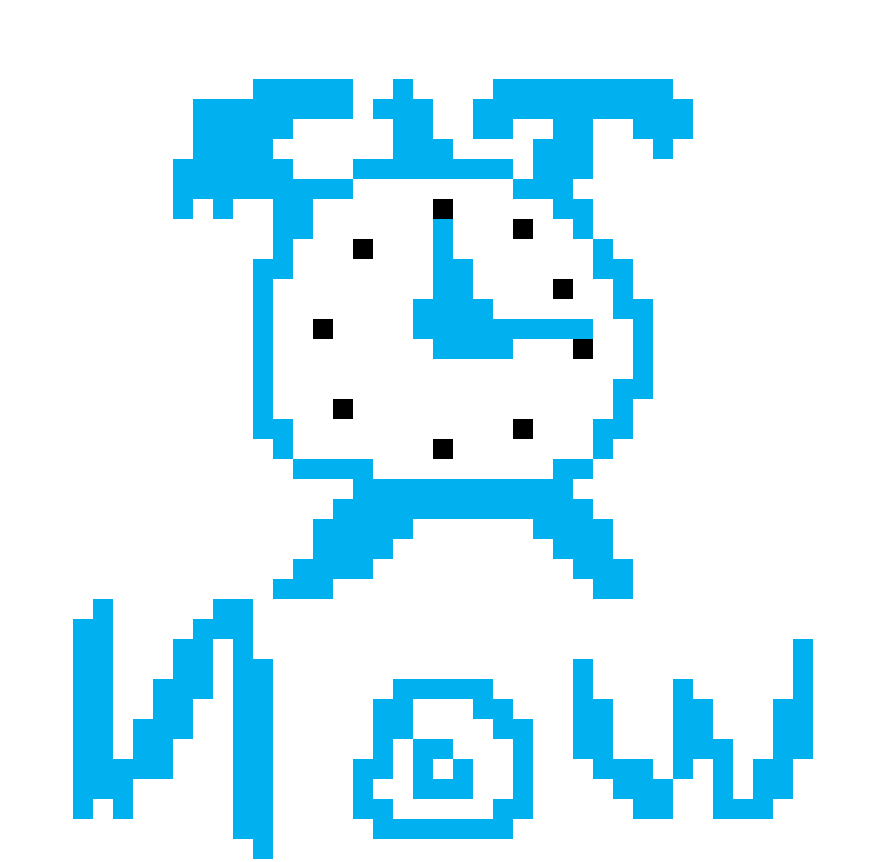
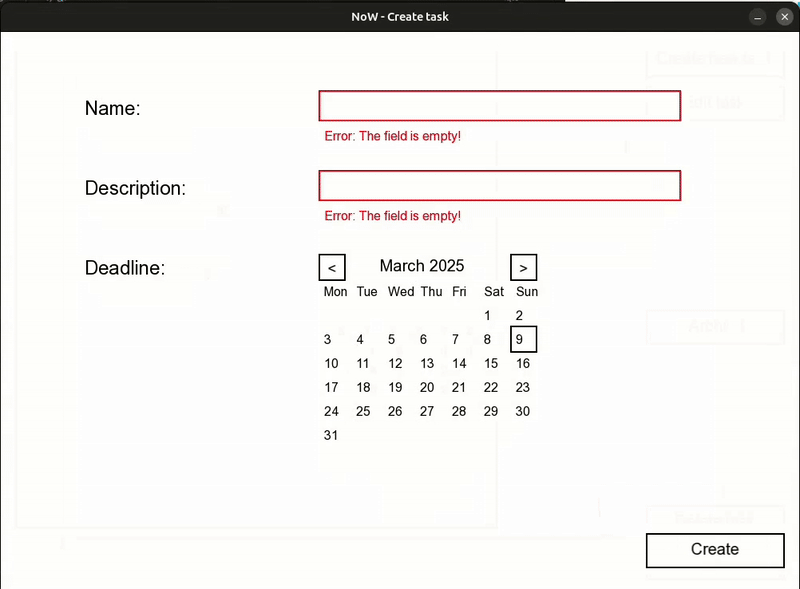

<a name="beginning"></a>

<!-- beginning -->
<br />
<div align="center">
  <h2>NoW — TaskPlanner</h2>
  <a href="https://github.com/semao0/NoW-Task-Planner">
    
  </a>
  <h3>Do it NoW!</h3>
  <a href="t.me/wdegrp">WDE</a>

</div>

<!-- contents -->
## Contents
  <ol>
    <li>
      <a href="#main-information">Main Information</a>
      <ul>
        <li><a href="#built-with">Built With</a></li>
      </ul>
    </li>
    <li>
      <a href="#getting-started">Getting Started</a>
      <ul>SPP-Project
        <li><a href="#dependencies">Dependencies</a></li>
        <li><a href="#installation">Installation</a></li>
      </ul>
    </li>
    <li><a href="#contributing">Contributing</a></li>
    <li><a href="#license">License</a></li>
    <li><a href="#contact">Contact</a></li>
    <li><a href="#thanks">Thanks</a></li>
  </ol>


<!-- main info -->
### Main Information

<a href="https://github.com/semao0/NoW-Task-Planner">
  
</a>

This is my first project. It helped me understand the basic concepts of programming and taught me how to work with various tools. :alarm_clock:
This application is a simple task planner that is convenient for daily use. With it, you can:

+ Create Task: Add a new task with a title, description, and due date.
+ Edit Task: Modify existing tasks.
+ View Task Details: See detailed information about each task.
+ Archive Task: Move completed tasks to the archive.
+ Delete Task: Remove tasks you no longer need.

The following methods were also used here:
+ Saving data in json
+ Validation system
+ Object-oriented programming
+ Multi-file project
+ etc.

> [!TIP]
> All graphic elements were hand-drawn. Their rendering, updating, and event handling were implemented from scratch!

<p align="right">*<a href="#beginning">beginning</a>*</p>

### Built With

+ [![C++][cpp]][cpp-url]
+ [![CMake][cmake]][cmake-url]
+ [![nlohmann_JSON][nlohmann_json]][nlohmann_json-url]
+ [![SFML][sfml]][sfml-url]

<p align="right">*<a href="#beginning">beginning</a>*</p>

<!-- Dependencies and Installation -->
## Getting Started

### Dependencies

+ CMake - 3.28.3
+ SFML - 2.6.0
+ nlohmann_json - 3.11.3
+ Linux or Windows operating system
+ clang - 18.1.3
> [!CAUTION]
> The application was developed and tested on Ubuntu, a Linux-based distribution.

### Installation

1. Clone the repo
   ```sh
   git clone https://github.com/semao0/NoW-Task-Planner.git
   ```
2. Navigate to the project's root directory
   ```sh
   cd NoW-Task-Planner
   ```
3. Set up the paths to dependencies in CMakeLists.txt
   ```cmake
    set(CMAKE_C_COMPILER "/path/to/libries/clang")
    set(CMAKE_CXX_COMPILER "/path/to/libries/clang++")

    set(SFML_DIR "/path_to_libraries/SFML-2.6.0/lib/cmake/SFML")

    set(NLOHMANN_JSON_DIR "/path/to/nlohmann_json")
   ```
4. Build a project
   ```sh
    cmake -S . -B build -G Ninja
    cmake --build build
   ```
5. Run the executable file
   ```sh
   ./build/NoW-Task-Planner
   ```

<p align="right">*<a href="#readme-top">beginning</a>*</p>

<!-- constributing -->
## Contributing
I really appreciate the concept of open source, where people can download a repository and suggest new features or bug fixes. :thinking:
If you find a bug, have a suggestion for improvement, or have already implemented an improvement, please contact me or submit a pull request. I will definitely respond (issues are also welcome :D)!

<!-- license -->
## License
This project is licensed under the MIT License. See the [LICENSE](./LICENSE) file for details.
<p align="right">*<a href="#readme-top">beginning</a>*</p>

<!-- contact -->
## Contact

Semen Belousov - belousovsemen40@gmail.com
> [!IMPORTANT]
> I wouldn't mind getting to know you and collaborating on something together!)
<p align="right">*<a href="#readme-top">beginning</a>*</p>

<!-- thanks -->
## Thanks

+ [SFML Library](https://www.sfml-dev.org/) - Nothing would have happened without him :D
+ [nlohmann_JSON](https://github.com/nlohmann/json) - It was convenient to work with your product :+1:
+ [WDE](t.me/wdegrp) - My friends supported me :raising_hand:
  
<p align="right">*<a href="#readme-top">beginning</a>*</p>


<!-- links & images -->
[cpp]: https://img.shields.io/badge/c++-%2300599C.svg?style=for-the-badge&logo=cplusplus&logoColor=white
[cmake]: https://img.shields.io/badge/CMake-%23008FBA.svg?style=for-the-badge&logo=cmake&logoColor=white
[nlohmann_json]: https://img.shields.io/badge/nlohmann_json-%23000000.svg?style=for-the-badge&logo=json&logoColor=white
[sfml]: https://img.shields.io/badge/SFML-%238CC445.svg?style=for-the-badge&logo=sfml&logoColor=white
[cpp-url]: https://cplusplus.com/
[cmake-url]: https://cmake.org/
[nlohmann_json-url]: https://github.com/nlohmann/json
[sfml-url]: https://www.sfml-dev.org/